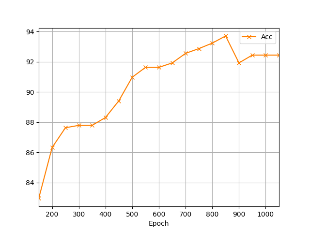

## Deep Learning
>Bearing Fault Detection and Classification Based on Temporal Convolutions and LSTM Network in Induction Machine Systems.

## GRU Results
|Downsampling|Sequence Length|Train (Samples)|Test (Samples)|Classes|
|:---:|:---:|:---:|:---:|:---:|
|Yes|899|3095 |890|16|
|No|1000|3095 |890|16|

|Run |Epoch|Batch Size|Architecture|Weights|Downsampling |Accuracy|
|---|:---:|:---:|:---:|:---:|:---:|:---:|
|1|600|128|[#1](#1-architecture)|1|Yes|71.46%|
|2|1200|128|[#1](#1-architecture)|2|Yes|84.26%|
|3|1200|128|[#2](#2-architecture)|3|Yes|84.94%|
|`4`|1200|128|[#3](#3-architecture)|4|Yes|`87.52%`|
|5|900|64|[#1](#1-architecture)|5|Yes|83.37%|
|_|_|_|_|_|_|_|
|6|200|128|[#4](#4-architecture)|-|No|71.35%|
|7|500|128|[#4](#4-architecture)|-|No|94.65%|
|8|650|128|[#4](#4-architecture)|-|No|95.37%|
|9|700|128|[#4](#4-architecture)|-|No|95.48%|
|10|900|128|[#4](#4-architecture)|-|No|95.62%|
|`11`|1050|128|[#4](#4-architecture)|-|No|`95.77%`|
|_|_|_|_|_|_|_|
|12|600||[#5](#5-architecture)|-|No|91.91%|
|`13`|850||[#5](#5-architecture)|-|No|`93.70%`|
|14|1000||[#5](#5-architecture)|-|No|92.43%|
|15|1050||[#5](#5-architecture)|-|No|92.43%|
### Path of the weight matrix
1) ~~./weights/grufcn_64_cells_weights/run_12_gru_with_softmax_weights.h5~~
2) ~~./weights/grufcn_64_cells_weights/run_12_gru_with_softmax_weights.h5~~
3) ~~./weights/grufcn2_64_cells_weights/run_12_gru_with_softmax_weights.h5~~
4) ~~./weights/grufcn3_64_cells_weights/run_12_gru_with_softmax_weights.h5~~
5) ~~./weights/grufcn_64_cells_weights/run_12_gru_with_softmax_weights.h5~~

## Downsampling (Yes)
### #1 Architecture
`Conv1D(128) => Conv1D(128) => Conv1D(128) => Conv1D(64)`

### #2 Architecture
`Conv1D(128) => Conv1D(256) => Conv1D(256) => Conv1D(64)`

### #3 Architecture
`Conv1D(64) => Conv1D(128) => Conv1D(256) => Conv1D(64)`

## Downsampling (No)
### #4 Architecture
`Conv1D(128) => Conv1D(128) => Conv1D(128) => Conv1D(64)`

    
    <em>#4 Architecture Results</em>

### #5 Architecture
`Conv1D(64) => Conv1D(64) => Conv1D(64) => Conv1D(128) => Conv1D(64)`
 

    
    <em>#5 Architecture Results</em>

